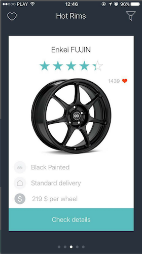

HotRims AR allows you to browse car rims and try them in augmented reality. 
While browsing, you can filter results, read reviews, view photos and add rims to your favorites list.
By using Unity and Vuforia you can try rims on any defined target you like.

## Build and Runtime Requirements
+ Xcode 9.0 or later
+ iOS 9.0 or later
+ macOS v10.10 or later

## Installation

### Setup Cocoapods repository

1. Run `pod install` to correctly setup the Cocoapods dependencies
2. Make sure that you open the project referring to  `*.xcworkspace` in Xcode or AppCode

## Screenshots

## Built With

* [Unity](https://unity3d.com/)
* [Vuforia](https://www.vuforia.com/)
* [Alamofire](https://github.com/Alamofire/Alamofire)
* [AlamofireObjectMapper](https://github.com/tristanhimmelman/AlamofireObjectMapper)
* [Kingfisher](https://github.com/onevcat/Kingfisher)
* [RealmSwift](https://realm.io/docs/swift/latest/)
* [Cosmos](https://github.com/evgenyneu/Cosmos)
* [SVProgressHUD](https://github.com/SVProgressHUD/SVProgressHUD)

